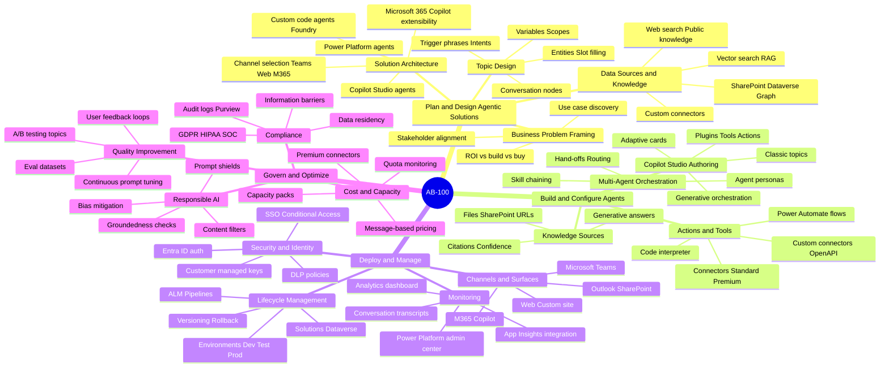
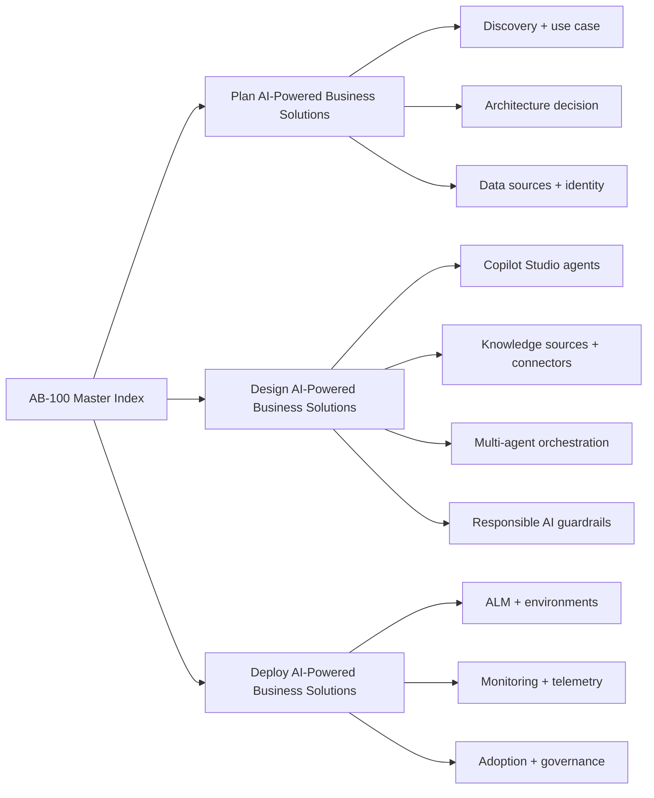
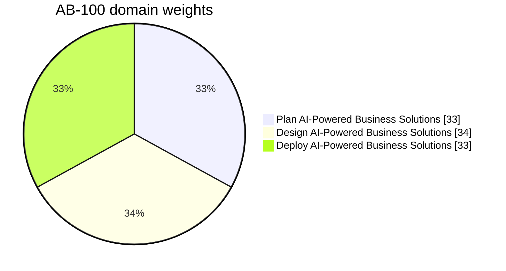

# AB-100 - Microsoft Certified: Agentic AI Business Solutions Architect - Visual Study Guide

> Concept-only study aid. No exam questions reproduced. Source PDF (if any) stays local + gitignored.

**Skills outline:** https://learn.microsoft.com/credentials/certifications/agentic-ai-business-solutions-architect/

## Audience

AB-100 is for the **business solutions architect** designing **agentic AI** systems on Microsoft Copilot Studio + Microsoft 365 + Power Platform. Unlike AB-730 (end user) and AB-731 (executive), AB-100 is hands-on: architecting, building, governing, and deploying autonomous AI agents.

## The 4 Exam Domains - Mind Map

## Domain map

## Domain weights

## Recommended study order

```mermaid
gantt
    title Suggested study plan
    dateFormat X
    axisFormat Day %d
    section Plan
    Plan AI-Powered Business Solutions :t1, 0, 2d
    Design AI-Powered Business Solutions :t2, after t1, 3d
    Deploy AI-Powered Business Solutions :t3, after t2, 2d
```

## Top 15 things to know

1. **Agent vs Copilot vs bot** - agent acts autonomously with tools, Copilot is conversational helper, bot is scripted topic flows.
2. **Copilot Studio** is the primary platform for building agentic AI in the Microsoft ecosystem.
3. **Knowledge sources** in Copilot Studio: SharePoint, public website, OneDrive, Dataverse, custom uploads, Microsoft Graph.
4. **Connectors** (1500+) enable agent actions in 3rd-party systems through Power Platform.
5. **Topics** define conversational flows; **Generative answers** uses LLM grounded on knowledge.
6. **Custom Copilot agents** are publishable to Microsoft 365 Copilot Chat, Teams, web channels, custom apps.
7. **Multi-agent orchestration** - agents calling other agents; orchestration layer routes tasks.
8. **Authentication options** - no auth, Microsoft Entra (ID), manual OAuth - pick for the channel.
9. **Power Platform environments** isolate dev / test / prod; managed environments for governance.
10. **DLP policies** in Power Platform restrict which connectors can be used together.
11. **Application Lifecycle Management (ALM)** - solutions, source control via Power Platform CLI, environment promotion.
12. **Telemetry** - Application Insights integration for traces, prompts, tokens.
13. **Responsible AI** - Microsoft Responsible AI Standard + Copilot Studio Content Moderation slider.
14. **Cost** - Copilot Studio per-message capacity unit; agent action consumption + Azure costs.
15. **Microsoft Copilot Tuning** - fine-tuning Microsoft 365 Copilot for org-specific tone / facts.

## Common gotchas

- Agent "knowledge" is RAG, NOT fine-tuning. Tone-tuning is separate (Copilot Tuning).
- Free Copilot Studio trial does not include connector premium licenses.
- Generative answers ON without knowledge source = generic LLM (no grounding).
- DLP policy violation blocks the agent at run-time, not at build-time.
- Topic + generative answers can both fire; orchestration determines order.

## Supporting pages

- [05-exam-cheatsheet.md](05-exam-cheatsheet.md)
- [06-references.md](06-references.md)
- [07-extra-ab100-concepts.md](07-extra-ab100-concepts.md)
- [08-learn-summaries.md](08-learn-summaries.md)
- [09-arch-ab100.md](09-arch-ab100.md)
- [11-microsoft-resources.md](11-microsoft-resources.md)
- [12-glossary.md](12-glossary.md)
- [13-flashcards.md](13-flashcards.md)
- [14-pitfalls.md](14-pitfalls.md)
- [15-hands-on-labs.md](15-hands-on-labs.md)
- [16-architecture-center.md](16-architecture-center.md)
- [17-copilot-quiz.md](17-copilot-quiz.md)
- [99-practice-assessment.md](99-practice-assessment.md)
- [99-video-tutorials.md](99-video-tutorials.md)

---

**Next:** open [01-plan-ai-solutions.md](01-plan-ai-solutions.md)
