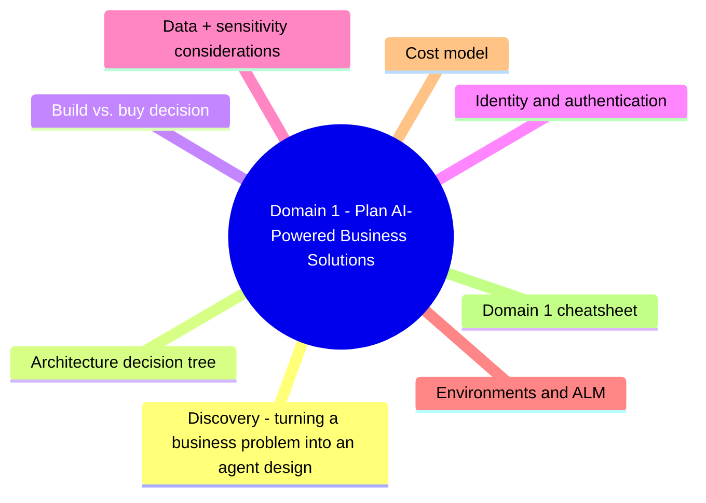
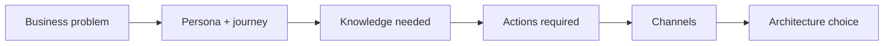
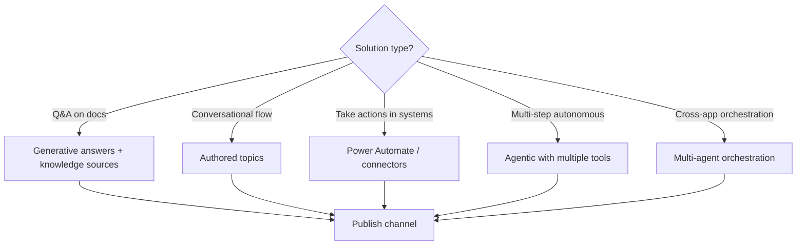
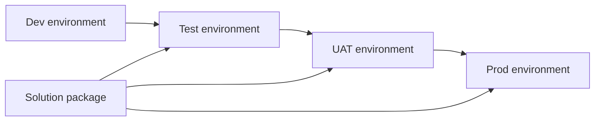

# Domain 1: Plan AI-Powered Business Solutions

> Discovery, requirements, and architectural choices BEFORE you build.

## Domain mind map

## Discovery: turning a business problem into an agent design

| Question | Decision driver |
|---|---|
| Who is the user? | Channel (Teams, Copilot Chat, web, mobile) |
| What knowledge? | Knowledge sources (SharePoint, web, custom) |
| What actions? | Connectors / Power Automate / custom API |
| Sensitive data? | Auth model + DLP + sensitivity labels |
| Volume / latency? | Pricing + capacity planning |

## Architecture decision tree

## Build vs. buy decision

| Need | Pick |
|---|---|
| Generic productivity (drafting, summarizing) | **Buy**: Microsoft 365 Copilot |
| Domain-specific Q&A or workflow | **Build with Copilot Studio** |
| Code-completion in IDE | **Buy**: GitHub Copilot |
| Customer-facing AI feature in your product | **Build with Azure AI Foundry / Azure OpenAI** |

## Identity and authentication

| Pattern | When |
|---|---|
| **No auth** | Public chatbot on website (limited capability) |
| **Microsoft Entra ID** | Internal employees; pass identity to connectors |
| **Manual OAuth** | Custom 3rd-party identity (e.g. specific SaaS) |
| **API key** | Service-to-service connectors |

> Always prefer Entra ID for internal agents - flow user identity to backend so per-user data security holds.

## Data + sensitivity considerations

| Concern | Mitigation |
|---|---|
| **Oversharing** in SharePoint surfaces in agent answers | Run M365 Copilot Optimization Assessment, apply Purview labels |
| **Per-user data filtering** | Use Entra ID + Microsoft Graph (already user-scoped) |
| **PII in prompts** | Power Platform DLP policies; redact in pre-processing |
| **Connector cross-pollination** | DLP groups: Business / Non-business / Blocked |

## Environments and ALM

- Each environment hosts its own Copilot Studio agent + connector references.
- Promote via **solutions** (managed solution recommended for prod).
- **Managed Environments** add governance: solution checker, DLP, capacity reporting.

## Cost model

| Component | Pricing |
|---|---|
| Copilot Studio | Per-message capacity unit (CU) - packs of 25k or 100k messages/month |
| Premium connectors | Per-user / per-flow plan |
| Power Automate | Per-flow / per-user |
| Azure OpenAI (custom model) | Token / PTU |
| Microsoft 365 Copilot license | Per-user/month (separate) |

## Domain 1 cheatsheet

| Wording | Answer |
|---|---|
| "agent that takes actions across systems" | Connectors + Power Automate flows |
| "agent that answers from docs" | Generative answers + knowledge sources |
| "agent that follows scripted dialog" | Topics |
| "isolate dev / test / prod" | Power Platform environments |
| "promote agent across environments" | Solutions |
| "block sensitive connector combinations" | DLP policies |
| "internal employee agent identity" | Microsoft Entra ID |
| "find SharePoint oversharing risk before deploy" | M365 Copilot Optimization Assessment |

---

**Next:** open [02-design-ai-solutions.md](02-design-ai-solutions.md)
