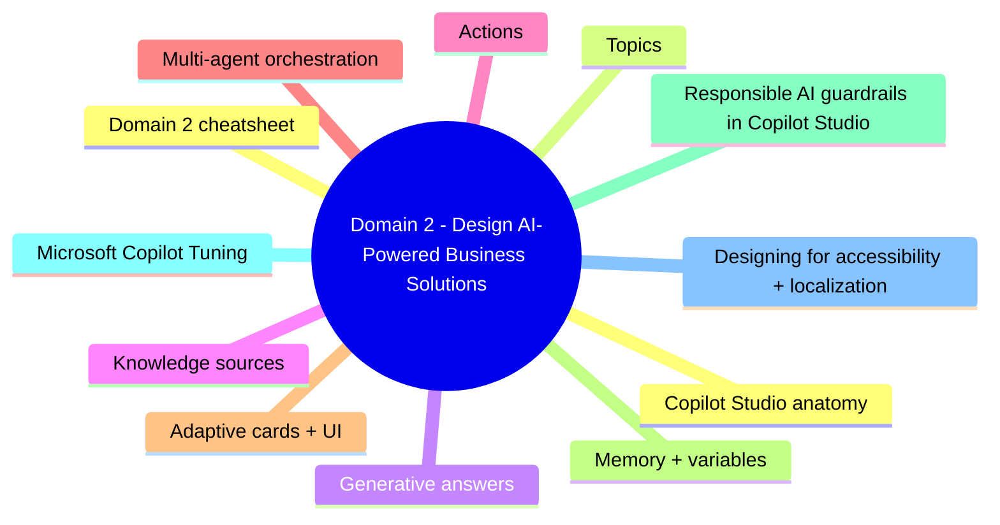
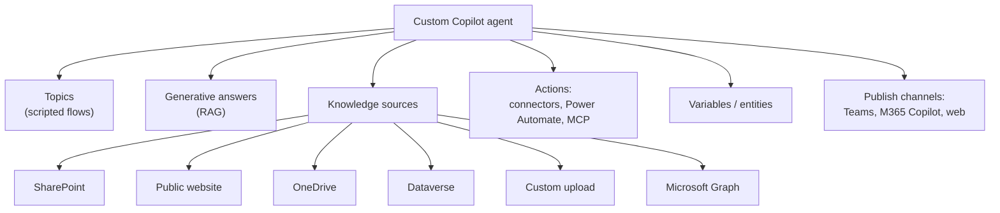
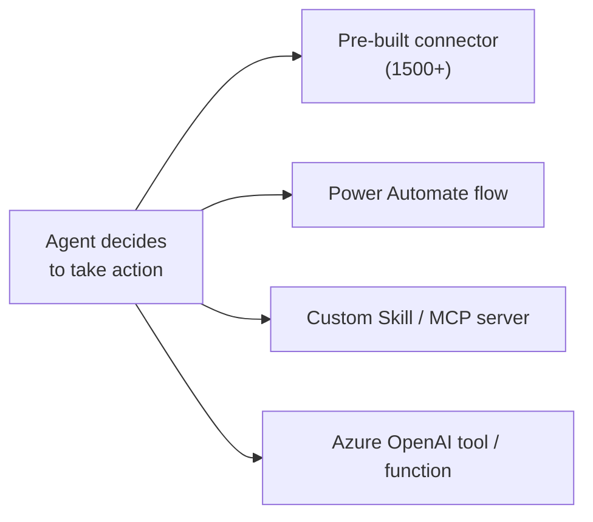
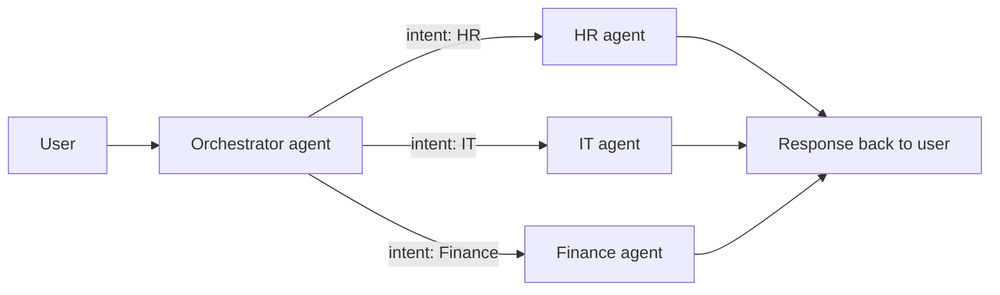

# Domain 2: Design AI-Powered Business Solutions

> Building agents in Copilot Studio: knowledge, actions, orchestration, guardrails.

## Domain mind map

## Copilot Studio anatomy

## Topics

- Trigger phrases or events.
- Authored conversation paths (questions, conditions, branches).
- Use **adaptive cards** for rich UI.
- Variables persist in conversation context.

## Generative answers

- LLM grounded on knowledge sources (RAG).
- Combine with Topics - topic captures intent, then generative answers within.
- Configure **moderation slider** - high (cautious) <-> low (permissive).

## Knowledge sources

| Source | When |
|---|---|
| **SharePoint site** | Internal docs, follows ACL via Graph |
| **Public website** | Public FAQ / docs |
| **OneDrive** | Personal-scope agent |
| **Dataverse** | Structured business data |
| **Custom upload** | One-off PDFs / docs |
| **Microsoft Graph (M365 Copilot agents)** | Mail, files, chats - per-user scoped |
| **Custom connector / API** | Bring your own search index |

## Actions

- **Connectors** - Power Platform standard + premium (Salesforce, ServiceNow, SAP, etc.).
- **Power Automate** - multi-step flow with logic and error handling.
- **MCP servers / Skills** - bring custom tools using the Model Context Protocol.

## Multi-agent orchestration

- **Orchestrator** routes user requests to specialist agents.
- Specialist agents have narrower knowledge + actions.
- Useful for enterprise-wide single front door.

## Adaptive cards + UI

- **Adaptive cards** render rich content in Teams, web, M365 Copilot.
- Use for confirmation prompts, multi-choice, image+button.

## Memory + variables

- **Conversation variable** - single conversation lifetime.
- **Bot variable** - across conversations for that user.
- **Global variable** - across all users (use carefully).

## Responsible AI guardrails in Copilot Studio

| Feature | What it does |
|---|---|
| Content moderation slider | Tunes filter strictness |
| Generative answers fallback | When generative confidence low, hand off to topic / human |
| AI prompt safety | Built-in jailbreak + prompt-injection mitigation |
| Telemetry | Application Insights for prompt + response audit |

## Microsoft Copilot Tuning

- **Microsoft 365 Copilot Tuning** - train M365 Copilot on org-specific writing style + facts.
- Submit curated documents; Microsoft tunes a model variant.
- Available with M365 Copilot license + qualifying SKU.

## Designing for accessibility + localization

- Use plain language; aim for grade 8 reading level.
- Multi-language: enable in agent settings; provide translations of topic prompts.
- Voice channel: configure SSML if needed.

## Domain 2 cheatsheet

| Wording | Answer |
|---|---|
| "Q&A grounded on docs" | Generative answers + knowledge sources |
| "scripted flow with branching" | Topics |
| "trigger an action in 3rd-party SaaS" | Connector or Power Automate flow |
| "tighten / loosen LLM safety" | Content moderation slider |
| "variable persists across conversations for one user" | Bot variable |
| "fan-out to specialist agents" | Multi-agent orchestration |
| "fine-tune Microsoft 365 Copilot for org" | Microsoft 365 Copilot Tuning |
| "rich UI in Teams response" | Adaptive card |

---

**Next:** open [03-deploy-ai-solutions.md](03-deploy-ai-solutions.md)
