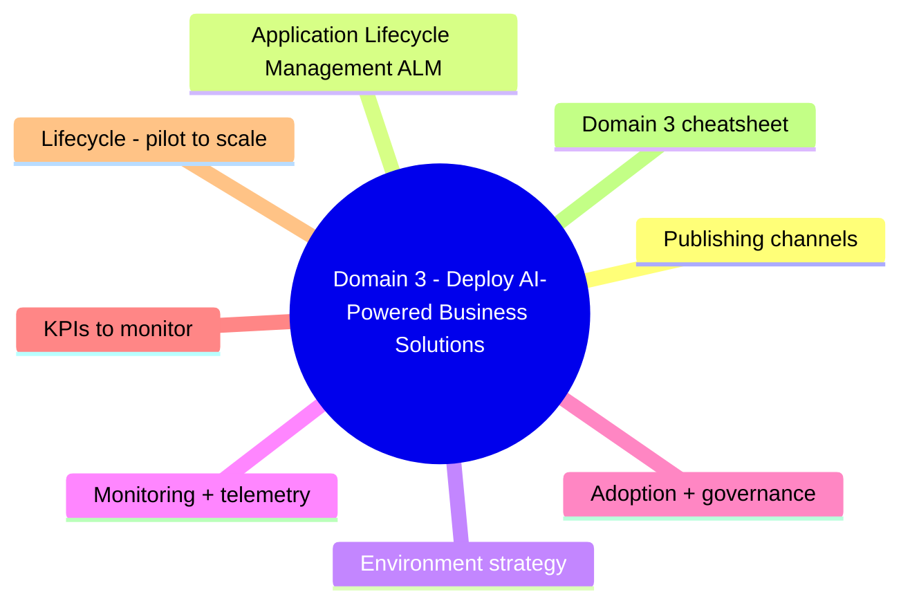
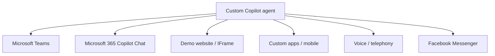
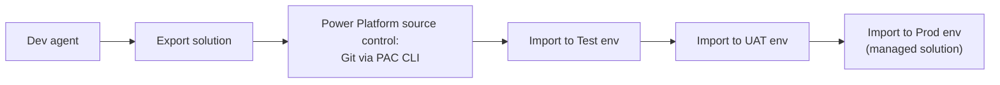
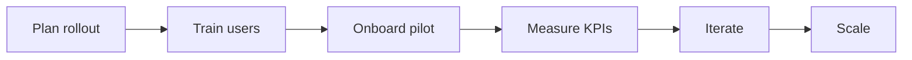

# Domain 3: Deploy AI-Powered Business Solutions

> Channels, ALM, monitoring, adoption.

## Domain mind map

## Publishing channels

| Channel | Auth | Notes |
|---|---|---|
| **Microsoft 365 Copilot Chat** | Entra ID | Most popular for internal agents |
| **Microsoft Teams** | Entra ID | Sideload via Teams admin / store |
| **Web demo / iframe** | None or OAuth | Public site or internal portal |
| **Custom apps (DirectLine)** | API key + bearer | Full programmatic control |
| **Voice / telephony** | Configurable | Through Power Virtual Agents voice channel |
| **Facebook Messenger / others** | Per-channel | Limited beta capabilities |

## Application Lifecycle Management (ALM)

- **PAC CLI** (Power Platform CLI) - export/import solutions, source control integration.
- **GitHub Actions** + **Azure DevOps** templates available for pipelines.
- **Solution checker** runs static analysis on managed environments.
- **Connection references** - abstract connection details so prod points to prod systems automatically.

## Environment strategy

| Env | Purpose | Notes |
|---|---|---|
| Dev | Maker iteration | Default Power Platform environment is shared - use a dedicated dev env per maker for isolation |
| Test | QA / integration | Refresh from dev frequently |
| UAT | Business validation | Customer / business owners validate |
| Prod | Production | Managed environment + DLP + monitoring |

## Monitoring + telemetry

| Capability | Where |
|---|---|
| Conversation analytics | Built-in Copilot Studio dashboard |
| Topic performance | Built-in (resolution rate, escalation rate) |
| Application Insights | Connect for end-to-end traces |
| Power Platform admin center | Capacity, DLP, environment audit |
| Microsoft Purview | Audit log for sensitive data flow |

## Adoption + governance

- **Center of Excellence (CoE) Starter Kit** - Microsoft toolkit to govern Power Platform / Copilot Studio at scale.
- **Champion network** - local makers and adopters.
- **Maker training** - Power Platform learning paths.
- **DLP policies** - managed centrally; review for new connectors.

## KPIs to monitor

| KPI | Why |
|---|---|
| Sessions / day | Adoption indicator |
| Resolution rate | % of conversations agent fully handled |
| Escalation rate | % handed off to human |
| User satisfaction (CSAT) | Quality |
| Cost per session | Capacity planning |
| Top failed topics | What to fix next |

## Lifecycle: pilot to scale

| Phase | Duration | Goal |
|---|---|---|
| Pilot | 4-8 weeks | Prove value with limited audience |
| Wave 1 | 8-12 weeks | Roll out to one full department |
| Wave 2+ | Quarterly | Add domains, refine governance |
| Optimize | Continuous | Tune topics, knowledge, prompts |

## Domain 3 cheatsheet

| Wording | Answer |
|---|---|
| "isolate dev / test / prod for agents" | Power Platform environments |
| "package agent for promotion" | Solution (managed solution for prod) |
| "command-line tool for ALM" | PAC CLI (Power Platform CLI) |
| "centralized governance kit" | CoE Starter Kit |
| "block sensitive connector mixes" | DLP policies |
| "where to view conversation analytics" | Copilot Studio analytics dashboard |
| "deeper traces / app insights" | Application Insights integration |
| "adoption KPI vs vanity metric" | Resolution rate / CSAT vs sessions only |

---

**Next:** open [05-exam-cheatsheet.md](05-exam-cheatsheet.md)
