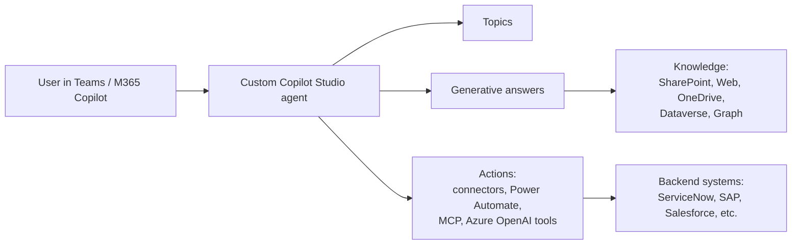
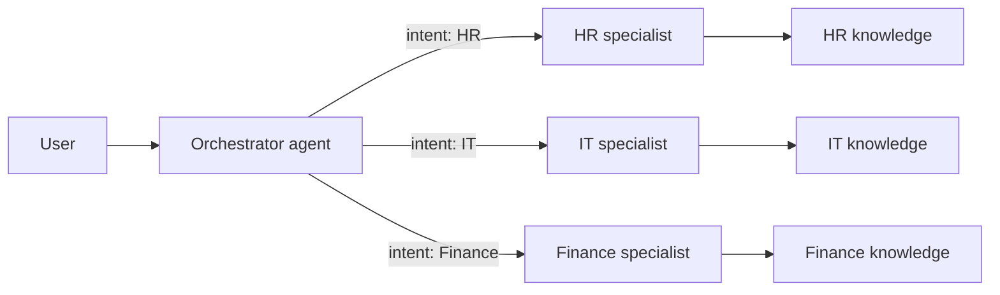
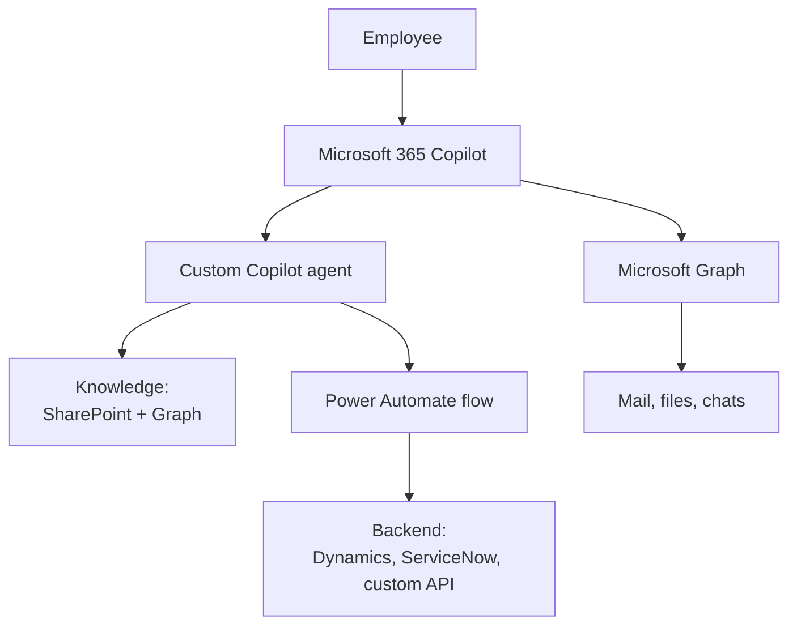
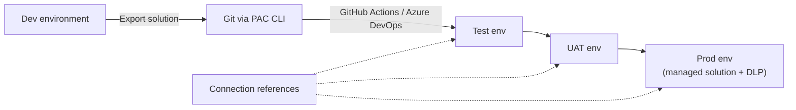
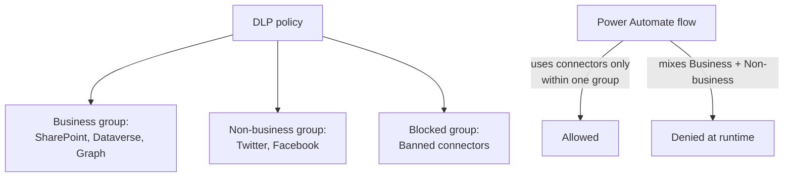
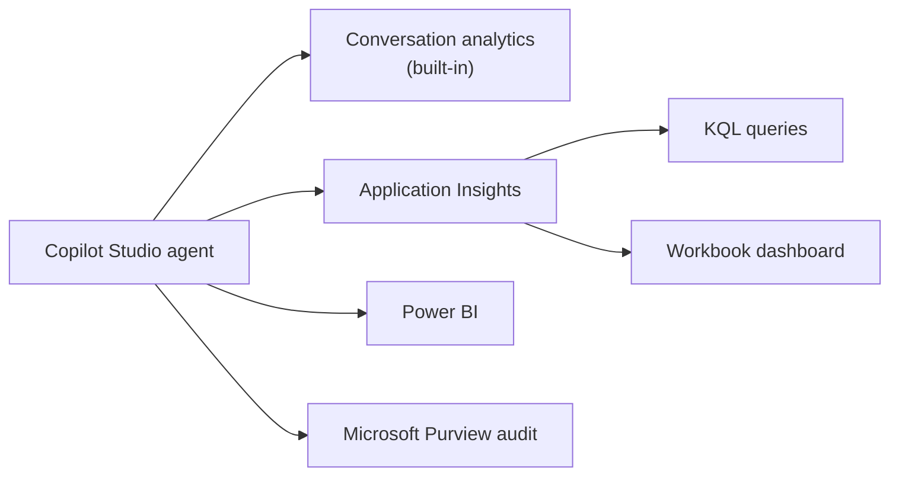
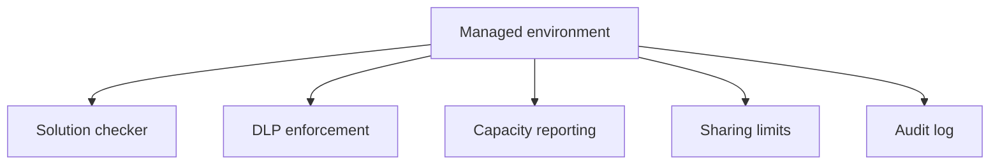

# AB-100 Architectures

## 1. Custom Copilot agent (single agent)

## 2. Multi-agent orchestration

## 3. Agent in Microsoft 365 Copilot ecosystem

## 4. ALM pipeline

## 5. DLP policy enforcement

## 6. Telemetry pipeline

## 7. Managed environment governance

---

[Master Index](00-MASTER-INDEX.md)
